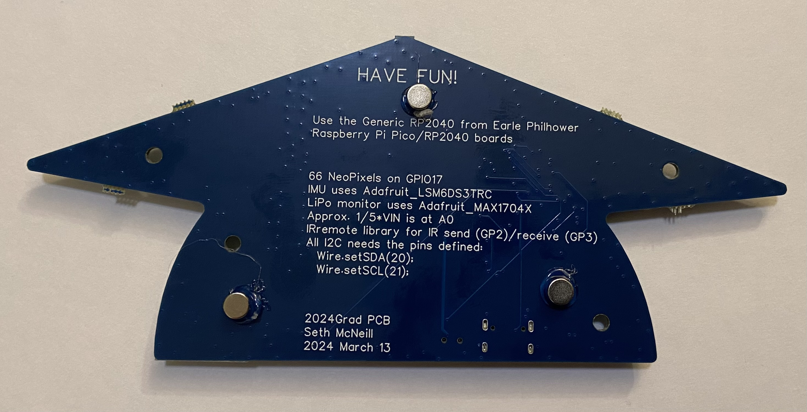

# 2024 Graduation Gift Board

The board is currently running gradMain2024. Press the button labeled GPIO8 to change modes. It should cycle through showing a blue/yellow graduation hat, lighting all the LEDs red/green/blue, using the IMU to display an artificial horizon, and showing an estimation of the current battery percent. The battery reading only works if there is a battery in the holder and the switch is in the ON position. I have only tested the board with the rechargeable version of the CR2450. It does not have a charger built in or a low voltage cutoff. 

The other sketches show how to use some of the capabilities not in the main sketch yet. 

